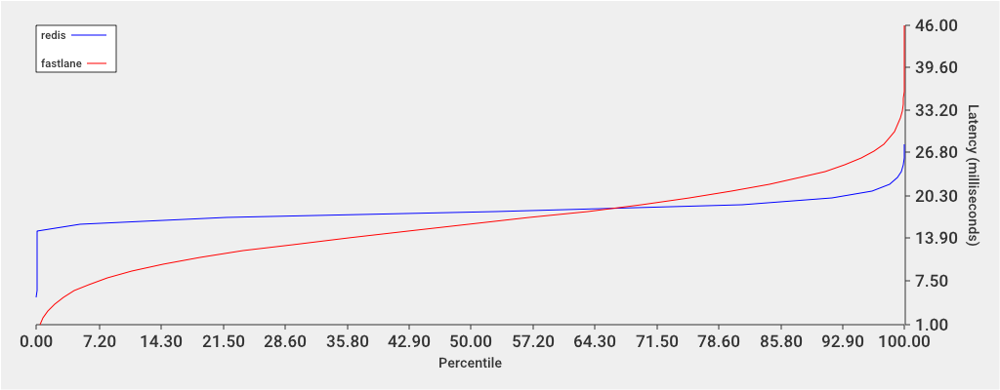

[](https://travis-ci.org/simongui/tantrum)

# Tantrum
Tantrum is a Redis benchmarking orchestration tool. It can benchmark against multiple Redis servers and graph results and returns an imgur link to the graph.

# macOS Requirements (El Capitan and Sierra)
```
xcode-select --install
brew install openssl
ln -s /usr/local/opt/openssl/include/openssl /usr/local/include
```

# Usage
```
make
./tantrum --hosts=redis:localhost:6379,fastlane:localhost:6380
Sleeping for 5 seconds
Running benchmark against redis on localhost:6379
Sleeping for 5 seconds
Running benchmark against fastlane on localhost:6380
http://i.imgur.com/8fmU41v.png
```


